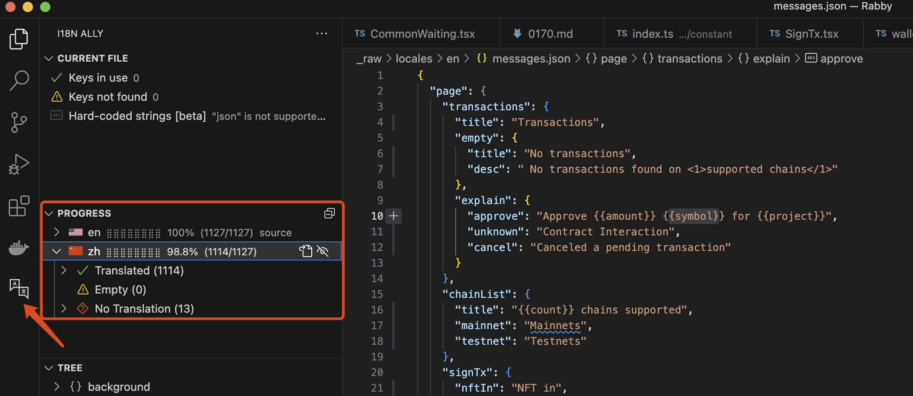

## Adding a new Language

- Each supported language is represented by a folder in app/locales whose name is that language's subtag (example: app/locales/es/). (look up a language subtag using the [r12a "Find" tool](https://r12a.github.io/app-subtags/) or this wikipedia list).
- Inside that folder there should be a messages.json.
- An easy way to start your translation is to first make a copy of `_raw/locales/en/messages.json` (the English translation), and then translate the message key for each in-app message.
- Add the language to the [locales index](https://github.com/RabbyHub/Rabby/blob/develop/_raw/locales/index.json) `_raw/locales/index.json`

## Testing
If you use VSCode, [i18n Ally extension](https://marketplace.visualstudio.com/items?itemName=Lokalise.i18n-ally) is suggested to be installed to check for missing content. After enabling, there will be an additional "i18n Ally" option on the left sidebar. Click on "Progress" to view the translation completion of each language

If you want to verify that your translations are displayed correctly in Rabby Wallet, follow the [local startup tutorial](https://github.com/rabbyhub/rabby#contribution) to start Rabby and switch to your language.